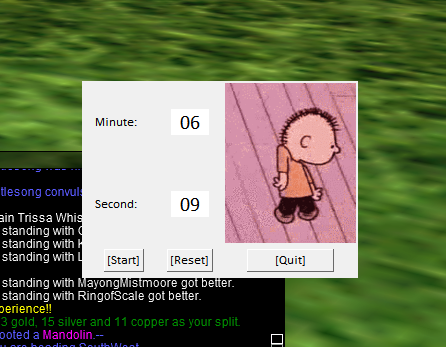
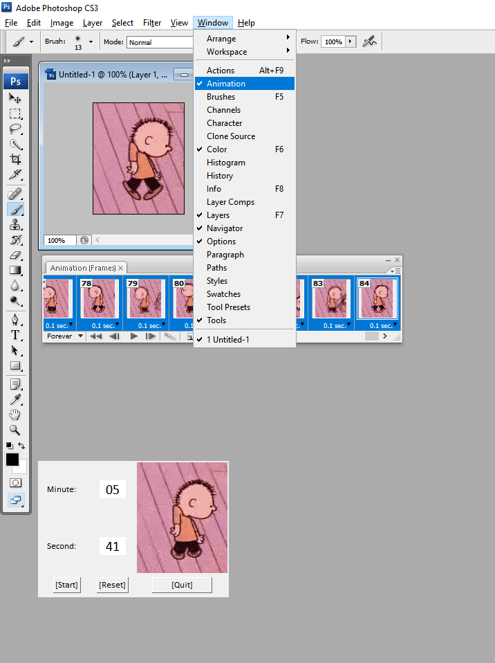

# bardtimer

- py bard.py

---------
If you want a longer animation in Tkinter, you have to duplicate the frames

Tkinter doesn't recognize that the animation should play forever

Here is how to edit it in Photoshop, more instructions inside the file

