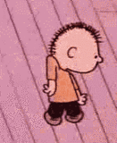

# bardtimer
Libaries used, and ones you need to install:
``time``
``os``
``sys``
``tkinter``
``PIL``
``itertools``

Once you've installed everything, dance around, then open a terminal window where the files are saved, and type

- py bard.py

[Start] - Starts the timer

[Reset] - Deletes the instance of the window and restarts a new app

[Quit] - Closes the app

Once the timer reaches 0 the gif will play.

To move the window just select the background of the tkinter-window and you'll be able to drag it anywhere.
It's a bit slow when the timer is running, and I'm not quite sure why.
If you want to move where the window 'spawns,' you can edit the file and make it spawn in a different place, than bottom left part of the screen. Look for Geometry; the first numbers are the window size, the 2nd set are where the window spawns. i.e. 250+150+55+777 | {250+150} = window dimensions | {55+777} = screen placement

---------

If you want a longer animation in Tkinter, you have to duplicate the frames

Tkinter doesn't recognize that the animation should play forever

Here is how to edit it in Photoshop, more instructions inside the file

